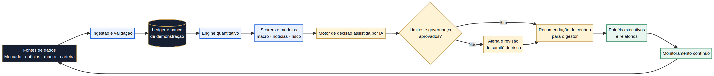
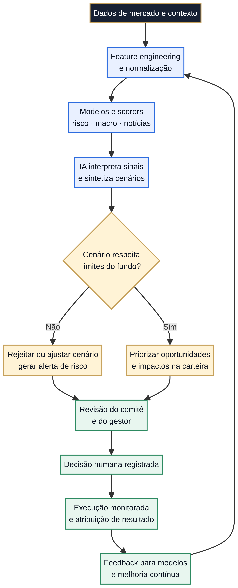
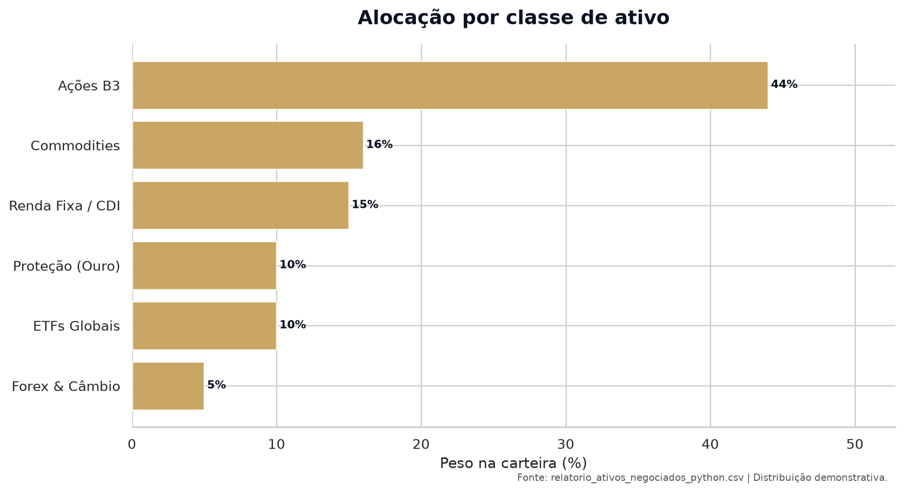
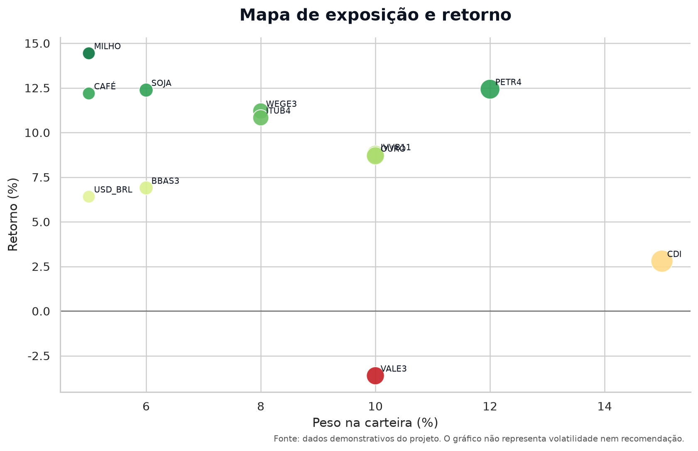
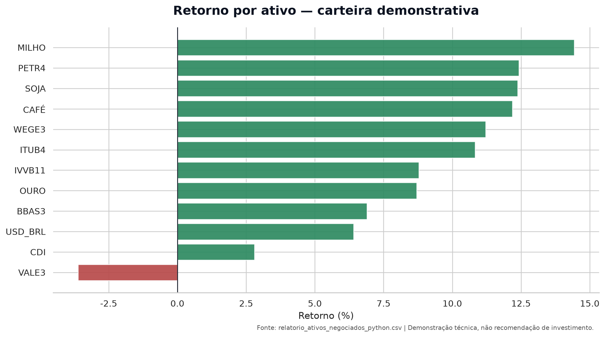
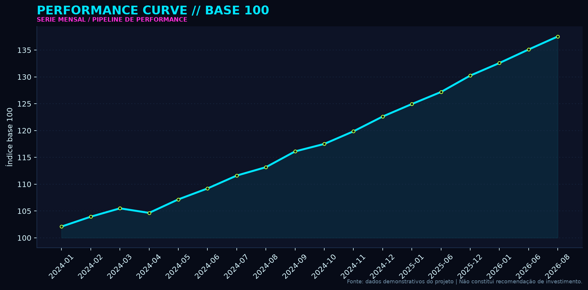
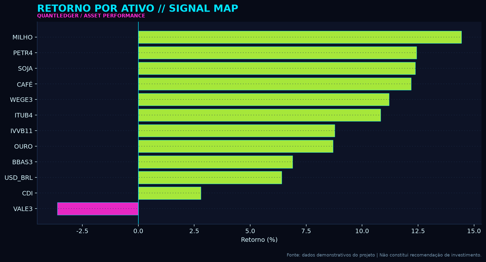
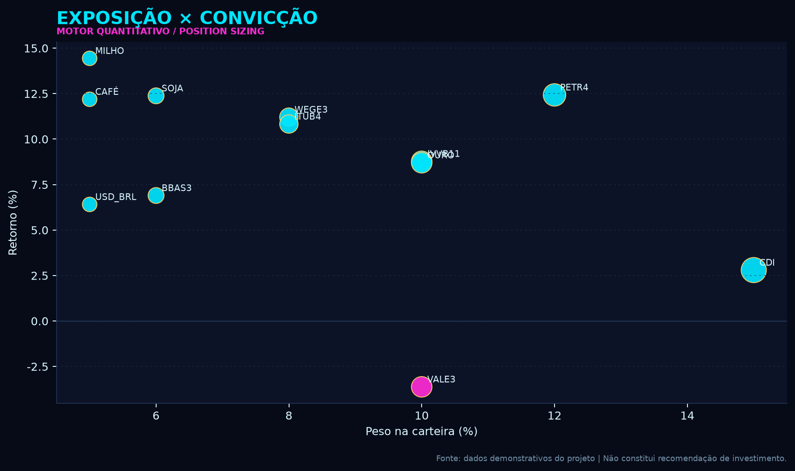
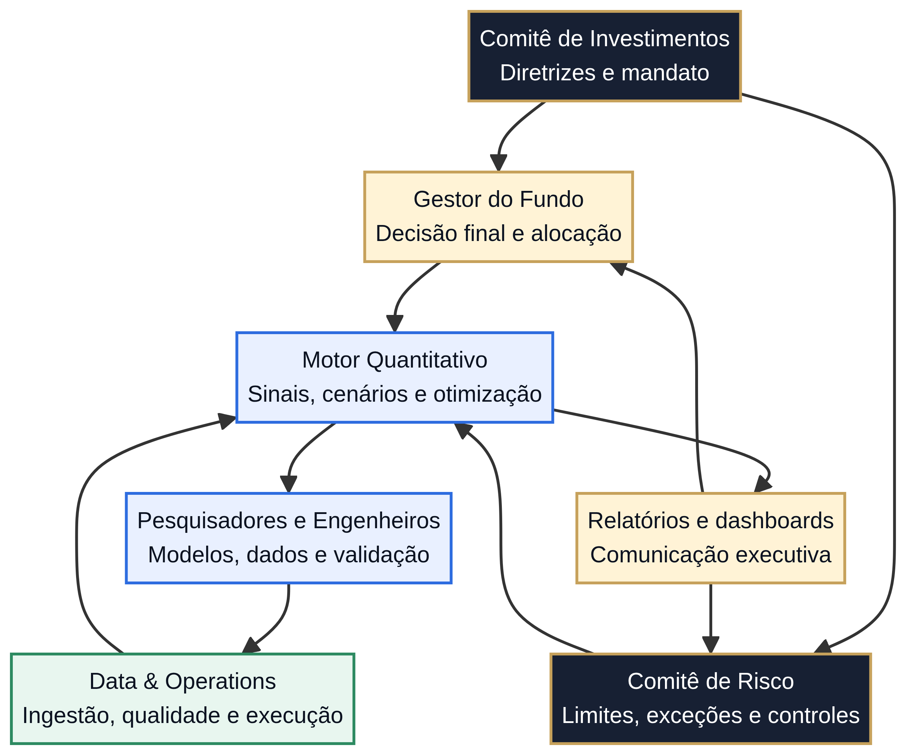

# QuantLedger — Harpia Quant AI

<p align="center">
  
</p>

<p align="center">
  
</p>

> **Carta técnica:** o QuantLedger representa a camada de inteligência de um fundo quantitativo multimercado. Ele conecta dados, modelos Python, controles de risco, decisão assistida por IA e comunicação executiva em um fluxo único e auditável.

## 1. O que é o fundo representado

O projeto representa uma operação quantitativa orientada por dados, com alocação entre ações brasileiras, ETFs globais, commodities, proteção cambial, ouro e caixa remunerado. A tese é combinar **convicção seletiva**, proteção de capital e disciplina de risco, evitando que uma única narrativa de mercado determine toda a carteira.

O fundo não é descrito aqui como uma promessa de retorno. O repositório é uma demonstração técnica e conceitual: os números, cenários e posições servem para mostrar como o motor organiza uma decisão de investimento e como a governança valida essa decisão antes de qualquer ação.

## 2. Visão executiva da carteira

| Indicador | Valor demonstrativo |
|---|---:|
| Capital alocado | **R$ 100.000.000,00** |
| Peso total da carteira | **100,00%** |
| PnL não realizado | **R$ 7.868.503,80** |
| Maior exposição individual | **PETR4 — 12,00%** |
| Maior retorno individual | **MILHO — 14,44%** |
| Pior retorno individual | **VALE3 — −3,62%** |
| Perfil operacional | Long, hedge e caixa |

## 3. Tese de investimento

A tese do fundo é construída em quatro camadas. A primeira é a leitura de regime: o motor observa contexto macroeconômico, notícias, comportamento dos preços e condição de liquidez. A segunda é a seleção de ativos: cada posição precisa apresentar uma combinação coerente de retorno esperado, diversificação e contribuição para o risco total. A terceira é a proteção: ouro, câmbio, ETFs globais e caixa reduzem a dependência de um único fator doméstico. A quarta é a governança: sinais quantitativos não viram decisão automaticamente; eles passam por limites, revisão e registro.

> **Tese central:** manter exposição onde há confirmação de tendência e contribuição de risco controlada, enquanto as posições de proteção preservam flexibilidade para atravessar mudanças de regime.

## 4. Como o motor quantitativo funciona

O motor é organizado como uma cadeia Python ponta a ponta. O pipeline inicia na ingestão, valida e grava os dados, calcula sinais e métricas, simula cenários, verifica limites e produz uma leitura para o gestor ou comitê. A camada de IA interpreta os sinais e sintetiza o cenário; ela não substitui a decisão humana nem autoriza uma operação fora das regras do fundo.

```text
Fontes de mercado, macro, notícias e carteira
                    ↓
Ingestão, normalização e validação dos dados
                    ↓
Ledger, banco local e providers Python
                    ↓
Engine quantitativo: contexto, execução e meta-learning
                    ↓
Scorers: macro, notícias, risco e atribuição
                    ↓
IA interpreta sinais e organiza cenários
                    ↓
Limites rígidos, EWS, VaR, Monte Carlo e comitê de risco
                    ↓
Tese de investimento, decisão registrada e monitoramento
                    ↓
Relatórios, gráficos e atualização do README
```



### 4.1 Componentes Python do motor

| Camada | Arquivos principais | Função |
|---|---|---|
| Orquestração | `pipeline_ponta_a_ponta.py` | Executa ingestão, processamento, relatório e exportação |
| Engine | `engine/context.py`, `engine/execution.py`, `engine/meta_learning.py` | Contexto de mercado, execução e adaptação do motor |
| Scorers | `engine/scorers/macro.py`, `engine/scorers/news.py` | Converte macro e notícias em sinais interpretáveis |
| Providers | `providers/data_manager.py`, `providers/base.py`, `providers/dual_writer.py` | Integra dados, persistência e escrita dupla |
| Banco | `db/seed_market_database.py`, `db/timescale_schema.py` | Schema, preparação e armazenamento de dados |
| Risco | `src/risk/monteCarlo.ts`, `src/risk/hardLimits.ts`, `src/risk/ews.ts` | Simulação, limites e alertas antecipados |
| Relatórios | `scripts/generate_portfolio_report.py` | Gera relatórios e visualizações de acompanhamento |
| Performance | `scripts/update_performance_readme.py` | Calcula métricas e atualiza o bloco de performance |



## 5. Alocação completa

A tabela abaixo reproduz a base de ativos disponível em `relatorio_ativos_negociados_python.csv`. O capital alocado totaliza R$ 100 milhões e o peso da carteira fecha em 100%.

| Ticker | Classe | Posição | Peso | Capital alocado | Entrada | Atual | Retorno | PnL não realizado |
|---|---|---|---:|---:|---:|---:|---:|---:|
| PETR4 | Ações B3 | BUY_LONG | 12,00% | R$ 12,0M | 34,20 | 38,45 | **+12,43%** | R$ 1.491.228,07 |
| VALE3 | Ações B3 | BUY_LONG | 10,00% | R$ 10,0M | 63,50 | 61,20 | **−3,62%** | −R$ 362.204,72 |
| WEGE3 | Ações B3 | BUY_LONG | 8,00% | R$ 8,0M | 38,80 | 43,15 | **+11,21%** | R$ 896.907,22 |
| ITUB4 | Ações B3 | BUY_LONG | 8,00% | R$ 8,0M | 31,40 | 34,80 | **+10,83%** | R$ 866.242,04 |
| BBAS3 | Ações B3 | BUY_LONG | 6,00% | R$ 6,0M | 26,10 | 27,90 | **+6,90%** | R$ 413.793,10 |
| IVVB11 | ETFs Globais | BUY_HEDGE | 10,00% | R$ 10,0M | 262,00 | 285,00 | **+8,78%** | R$ 877.862,60 |
| SOJA | Commodities | BUY_HEDGE | 6,00% | R$ 6,0M | 10,50 | 11,80 | **+12,38%** | R$ 742.857,14 |
| MILHO | Commodities | BUY_HEDGE | 5,00% | R$ 5,0M | 56,10 | 64,20 | **+14,44%** | R$ 721.925,13 |
| CAFÉ | Commodities | BUY_HEDGE | 5,00% | R$ 5,0M | 192,00 | 215,40 | **+12,19%** | R$ 609.375,00 |
| OURO | Proteção (Ouro) | BUY_HEDGE | 10,00% | R$ 10,0M | 385,00 | 418,50 | **+8,70%** | R$ 870.129,87 |
| USD_BRL | Forex & Câmbio | BUY_HEDGE | 5,00% | R$ 5,0M | 5,15 | 5,48 | **+6,41%** | R$ 320.388,35 |
| CDI | Renda Fixa / CDI | HOLD_CASH | 15,00% | R$ 15,0M | 1,00 | 1,03 | **+2,80%** | R$ 420.000,00 |

### 5.1 Visualizações da alocação e exposição







## 6. Gráficos Matplotlib em estilo cyberpunk

Os gráficos abaixo são gerados por Python e Matplotlib a partir dos dados versionados no repositório. A estética cyberpunk funciona como uma camada visual de monitoramento: ciano indica sinal ou fluxo, magenta indica atenção e lime indica performance positiva. As cores são visuais; não representam classificação regulatória de risco.







Para regenerar os gráficos:

```bash
python scripts/generate_cyberpunk_charts.py
python scripts/generate_readme_charts.py
```

## 7. Risco, rentabilidade e métricas avançadas

As métricas são atualizadas pelo script `scripts/update_performance_readme.py`, que lê a série mensal em `src/data/monthlyData.ts`. O cálculo é determinístico e substitui apenas o bloco entre `PERFORMANCE:START` e `PERFORMANCE:END`.

<!-- PERFORMANCE:START -->
### Rentabilidade e risco — atualização automática

| Métrica | Resultado demonstrativo |
|---|---:|
| Rentabilidade acumulada | **37.53%** |
| Rentabilidade anualizada | **23.67%** |
| Volatilidade anualizada | **2.56%** |
| Índice de Sharpe anualizado | **4.17** |
| Drawdown máximo | **-0.80%** |
| Benchmark acumulado | 11.97% |
| CDI acumulado | 17.49% |

_Período analisado: 2024-01 a 2026-08 (18 observações mensais). Os resultados são demonstrativos, derivados da série histórica presente no projeto, e não constituem promessa de rentabilidade ou recomendação de investimento._

<!-- PERFORMANCE:END -->

### Interpretação das métricas

| Métrica | Como o motor utiliza |
|---|---|
| Sharpe | Compara o retorno excedente ao CDI com a variabilidade da série, servindo como leitura de eficiência risco-retorno |
| Drawdown máximo | Mede a pior queda entre um pico acumulado e o vale seguinte, apoiando limites de preservação de capital |
| Volatilidade anualizada | Escala a dispersão mensal para uma referência anual e compara o risco realizado ao teto definido |
| Alfa contra benchmark | Mostra a diferença acumulada entre a carteira e o índice de referência |
| PnL por ativo | Identifica quais posições contribuíram ou destruíram resultado em termos monetários |

## 8. Governança e organograma decisório

A governança separa geração de sinal, validação de risco e decisão. O motor pode destacar uma oportunidade, mas o comitê verifica limites, liquidez, concentração, cenário adverso e aderência à tese antes de registrar a decisão.



| Instância | Responsabilidade |
|---|---|
| Comitê de investimentos | Define mandato, tese, objetivos e diretrizes de alocação |
| Gestão do fundo | Interpreta a leitura do motor e formaliza a decisão de carteira |
| Comitê de risco | Avalia limites, concentração, drawdown, liquidez e exceções |
| Pesquisa e engenharia | Mantém modelos, dados, validação e qualidade das features |
| Data & operations | Garante ingestão, persistência, rastreabilidade e operação do pipeline |

## 9. Controles de risco e funcionamento da IA

A IA é usada como camada de interpretação e síntese. Ela organiza sinais de macro, notícias, risco e performance em cenários compreensíveis para a governança. O sistema deve rejeitar ou encaminhar para revisão qualquer cenário que ultrapasse limites; a decisão humana permanece registrada no fluxo.


Os controles representados no projeto incluem limites rígidos, alertas antecipados, simulação Monte Carlo, leitura de concentração, análise de beta, VaR demonstrativo, liquidez e trilha de comitê. O objetivo é reduzir decisões sem contexto, não eliminar incerteza de mercado.

## 10. Execução ponta a ponta em Python

```bash
# 1. Preparar o ambiente
python -m venv .venv
source .venv/bin/activate
pip install -r requirements.txt

# 2. Executar o pipeline de dados e relatório
python pipeline_ponta_a_ponta.py

# 3. Gerar gráficos Matplotlib institucionais e cyberpunk
python scripts/generate_readme_charts.py
python scripts/generate_cyberpunk_charts.py

# 4. Atualizar Sharpe, drawdown e rentabilidade no README
python scripts/update_performance_readme.py

# 5. Validar a ingestão
python test_ingestion.py
```

A interface web em `src/` funciona como camada de visualização e acompanhamento. O núcleo analítico e o fluxo de dados demonstrativo estão documentados e executáveis pelos módulos Python, mantendo a separação entre processamento, governança e apresentação.

## 11. Estrutura do projeto

| Diretório | Conteúdo |
|---|---|
| `engine/` | Contexto, execução, interfaces, meta-learning e scorers |
| `providers/` | Providers, data manager e escrita dupla |
| `db/` | Schema e preparação do banco de demonstração |
| `api/` | Servidor de apoio em Python |
| `scripts/` | Relatórios, gráficos e atualização automática do README |
| `src/risk/` | Limites, EWS, Monte Carlo e comitê de risco |
| `docs/` | Gráficos, diagramas e assets institucionais |
| `relatorio_ativos_negociados_python.csv` | Dados demonstrativos de alocação, retorno e PnL |

## 12. Atualização automática no GitHub

O script de performance foi criado para ser executado localmente ou em uma rotina automatizada do GitHub Actions. Ele lê os dados versionados, calcula as métricas e atualiza somente o bloco controlado do README, evitando alterações acidentais no restante do documento.

Exemplo de execução local:

```bash
python scripts/update_performance_readme.py
git add README.md docs/
git commit -m "Update performance charts and risk metrics"
git push origin main
```

Para uma automação recorrente, o próximo passo é adicionar um workflow em `.github/workflows/update-performance.yml` com agendamento, instalação das dependências e commit automático dos gráficos e métricas atualizados.

## Observação de escopo

Este repositório é uma demonstração técnica e visual. Os dados, integrações, métricas e resultados devem ser validados antes de qualquer uso em produção ou decisão financeira real. Nenhuma informação aqui constitui oferta, recomendação ou promessa de rentabilidade.

## Tecnologias

`Python` · `Pandas` · `Matplotlib` · `FastAPI` · `SQLite` · `React` · `TypeScript` · `Vite` · `Monte Carlo` · `Risk Management` · `Data Visualization`
